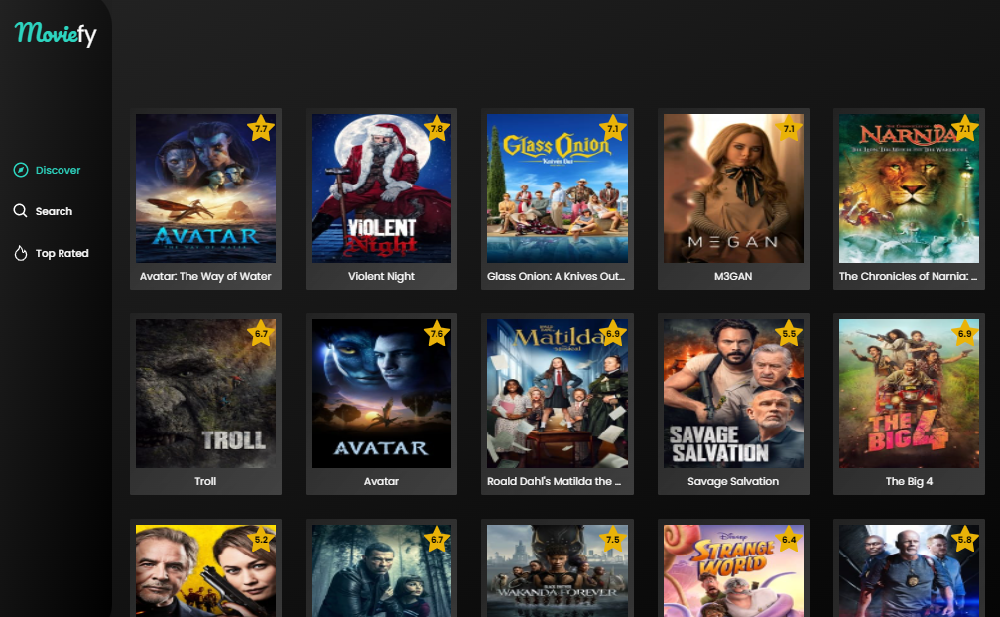

# Moviefy

Moviefy is a Next.js application designed to browse and discover popular and top-rated movies. With an intuitive user interface and seamless navigation, Moviefy offers a delightful experience for movie enthusiasts.

## Preview

Check out the Moviefy app [here](https://moviefy-webapp.vercel.app/).




## Features

- **Popular Movies**: Explore the latest popular movies with just a click.
- **Top Rated Movies**: Discover the highest-rated movies according to user reviews.
- **Search Functionality**: Find movies by title, genre, or keyword quickly and easily.
- **Bookmarks**: Add movies to bookmarks quickly and easily.
- **Pagination**: Navigate through a large collection of movies effortlessly with pagination support.
- **Dark/Light mode**.
- **Tailwind CSS Styling**: Stylish UI powered by Tailwind CSS for a modern look and feel.

## Technologies Used

- Next.js 14
- Tailwind CSS

## Installation

1. Clone the repository:

   ```bash
   git clone https://github.com/rida192/moviefy-next.js.git
    ```

2. **Navigate to the project directory:**

    ```bash
    cd moviefy-next.js
    ```

3. **Install dependencies:**

    ```bash
    npm install
    ```

4. **Start the development server:**

    ```bash
    npm run dev
    ```

5. **Open your browser and visit [http://localhost:3000](http://localhost:3000) to view Moviefy.**

## Usage

- On the homepage, you will see the most popular movies. Click on any movie to view details.
- Use the search bar at the top to find movies by title, genre, or keyword.
- Navigate through different pages of movies using pagination controls.
- Check out the top-rated movies in the dedicated section.
- Enjoy exploring and discovering new movies!

## Contributing

Contributions are welcome! If you'd like to contribute to Moviefy, please follow these steps:

1. Fork the repository.
2. Create a new branch (`git checkout -b feature/awesome-feature`).
3. Make your changes.
4. Commit your changes (`git commit -am 'Add awesome feature'`).
5. Push to the branch (`git push origin feature/awesome-feature`).
6. Create a new Pull Request.

---

**Note:** This project is for educational purposes only. All movie data is fetched from [The Movie Database (TMDb) API](https://www.themoviedb.org/documentation/api) and may be subject to copyright.
